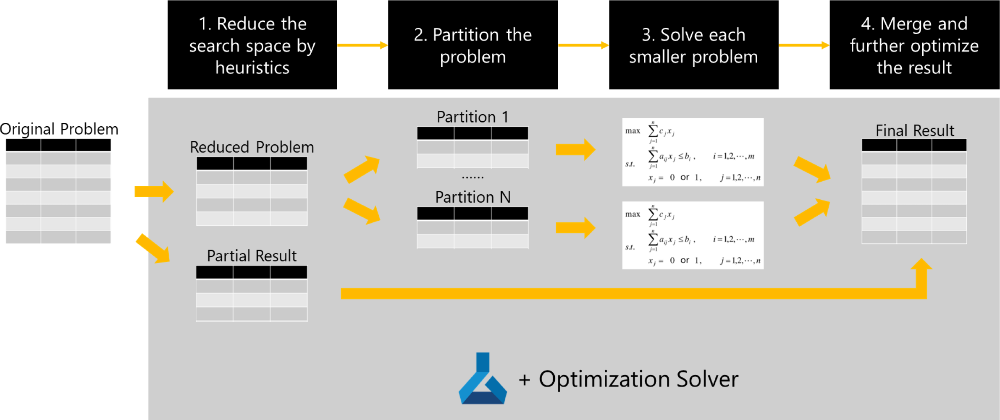

# Large-Scale Route Optimization Accelerator

This accelerator provides the code template to solve large-scale route optimization where the optimal solution cannot be found in reasonable time. A real world scenario is used to demonstrate the use of the accelerator. The implementation leverages Azure ML to create a general optimization framework where the large-scale route optimization problem is partitioned into many smaller problems. Each smaller problem can then be solved in parallel by any optimization solver. At the end, the results from all smaller problems will be merged into the final result. 


<!-- ## Challenges for Optimization Application

There are some common challenges for creating a production-grade optimization application:
1. Most optimization problems are [NP-hard](https://en.wikipedia.org/wiki/NP-hardness) (route optimization falls into this category). When the scale of the problem becomes large, it is impossible to find any good solution in a reasonable time.
2. The constraints in an optimization problem may change over time as the customer's business evolves. This creates the burden for maintaining the optimization application. 
3. Deploying the optimization application in a way that can be easy to consume by other applications is also crucial in practice.

To tackle challenge 1 and 3, in this accelerator, we will demonstrate an optimization framework using Azure ML that applies partitioning strategy to partition the large-scale route optimization problem into many smaller ones and then solve them individually. This is a practical way to solve any real-world large-scale optimization problem. We will also leverage Azure ML to deploy the optimization application as a REST API such that it can be easy to consume by other applications. 

A pure rule-based optimization application is difficult to maintain as the constraints of the problem change. A better way to tackle challenge 2 is to leverage [optimization solver](https://en.wikipedia.org/wiki/List_of_optimization_software) to model the problem and then let the solver search the solution automatically. There are many optimization techniques, e.g., Linear Programming (LP), Mixed Integer Programming (MIP), [Constraint Programming](https://en.wikipedia.org/wiki/Constraint_programming), etc. One can choose the best fit for their own problem since the framework introduced in this accelerator is optimization technique agnostic. In this accelerator, we demonstrate how to use Constraint Programming to model the route optimization problem.   

Comparing to mathematical optimization techniques (e.g., LP, MIP), Constraint Programming is more expressive since it allows us to express a larger collection of problems. For example, a constraint programming model has no limitation on the arithmetic constraints that can be set on decision variables, while a mathematical programming engine is specific to a class of problems whose formulation satisfies certain mathematical properties (for example: quadratic, MIQCP, and convex vs non-convex).

Besides, Constraint programming is also an efficient approach to solve and optimize problems that are too irregular for mathematical optimization. This includes time tabling problems, sequencing problems, and allocation or rostering problems.

The reasons for these irregularities that make the problem difficult to solve for mathematical optimization can be:
* Constraints that are nonlinear in nature
* A non convex solution space that contains many locally optimal solutions
* Multiple disjunctions, which result in poor information returned by a linear relaxation of the problem

To who is interested in the detailed comparison, one can refer to this [link](https://www.ibm.com/docs/en/icos/12.8.0.0?topic=overview-constraint-programming-versus-mathematical-programming).  -->

## Route Optimization - A Real World Scenario

The example demonstrated in this solution accelerator is inspired by a real world scenario. The customer is a manufacturing company. They have many warehouses in different locations. When they receive orders from their clients, the human planner need to plan the package to truck assignment. Because the packages may have different destinations, the planner also need to decide the route of this truck, namely, the order of the stops. After that, the truck will deliver its packages based on its assigned route. Each truck type has its cost measured by the travelling distance. The optimization objective here is to minimize the delivery cost incurred by the truck. 

This is a variant of the [vehicle routing problem (VRP)](https://en.wikipedia.org/wiki/Vehicle_routing_problem). The constraints modeled in our example are:
* There are different kind of trucks we can choose from. A truck has capacity limit on both area and weight. (We assume that there is no limit about the number of trucks for each type)
* A package is only available by a specific time. A truck can start only when all packages assigned to it are available.
* The difference between the maximum and minumum avalibale time of all packages in the same truck should be less than a user defined limit (e.g., 4 hours).  
* All packages need to be delivered to their destination before their deadline.
* Because of the properties of different products, some packages can put in the same truck but some cannot.
* A truck can have at most N stops, where N is a user defined number.
* A truck need to stay at each stop for M hours to unload the packages, where M is a user defined number. Besides, each stop will incur a fixed amount of cost to the total delivery cost. 

 | Order_ID | Material_ID | Plate_ID | Source | Destination | Available_Time | Deadline | Danger_Type | Area | Weight |
 | ----------- | ----------- | --------------|----------- | ----------- | --------------| ----------- | ----------- | --------------| --------------|
 | A140109 | B-6128 | P01-79c46a02-e12f-41c4-9ec9-25e48597ebfe | City_61 | City_54 | 2022-04-05 23:59:59 | 2022-04-11 23:59:59 | type_1 | 38880 | 30920000 | 
 | A140112 | B-6128 | P01-84ac394c-9f34-48e7-bd15-76f92120b624 | City_61 | City_54 | 2022-04-07 23:59:59 | 2022-04-13 23:59:59 | type_1 | 38880 | 30920000 | 
 | A140112 | B-6128 | P01-b70c94db-630a-497b-bb63-b0ad86a7dce6 | City_61 | City_54 | 2022-04-07 23:59:59 | 2022-04-13 23:59:59 | type_1 | 38880 | 30920000 | 
 | A140112 | B-6128 | P01-4534a7e8-6d73-4a2e-8363-a6645d9bc345 | City_61 | City_54 | 2022-04-07 23:59:59 | 2022-04-13 23:59:59 | type_1 | 38880 | 30920000 | 
 | A140112 | B-6128 | P01-7208eb61-2cc1-4e7c-b698-e1ab2327b658 | City_61 | City_54 | 2022-04-07 23:59:59 | 2022-04-13 23:59:59 | type_1 | 38880 | 30920000 | 
 | A190223 | B-6155 | nan-4ac2f30e-bc0a-4415-8612-a6b38d833317 | City_61 | City_53 | 2022-04-06 23:59:59 | 2022-04-12 23:59:59 | type_2 | 9840 | 7640000 | 
 | A190225 | B-6155 | nan-5ae70ea9-a28e-4107-b267-5a6c84d4a3c7 | City_61 | City_53 | 2022-04-05 23:59:59 | 2022-04-11 23:59:59 | type_2 | 9840 | 7640000 | 
 | A190226 | B-6155 | nan-c9658637-b5f1-433d-885e-b3008612a73d | City_61 | City_53 | 2022-04-07 23:59:59 | 2022-04-13 23:59:59 | type_2 | 9840 | 7640000 | 
 | A190226 | B-6155 | nan-75768ff3-3dde-4952-9aa0-594c373421d1 | City_61 | City_53 | 2022-04-07 23:59:59 | 2022-04-13 23:59:59 | type_2 | 9840 | 7640000 | 
 | A190226 | B-6155 | nan-39cdd29b-baee-4ed6-bec0-33227cc8608d | City_61 | City_53 | 2022-04-07 23:59:59 | 2022-04-13 23:59:59 | type_2 | 9840 | 7640000 | 

<!-- With the help of Constraint Programming, we can model all these constraints programmatically. There are a lot of CP solvers we can pick. In this accelerator, we use [Google OR-Tools](https://developers.google.com/optimization). It is open-sourced and its performance [surpasses many other solvers](https://www.minizinc.org/challenge2022/results2022.html). To learn about how to model a problem using CP in OR-Tools, one can refer to its [API documents](https://developers.google.com/optimization/reference/python/sat/python/cp_model). -->

# Solution Design

The key idea of this accelerator is to implement a general framework to solve the large-scale route optimization problem. The end-2-end pipeline is implemented using Azure ML pipeline consisting of 4 key steps. The complete definition of the pipeline can be found in this [notebook](./notebook/aml_pipeline.ipynb).



1. **Reduce Search Space**: Given the problem space is huge, it could be a good idea to adopt some human heuristics to assign part of the packages first. There two reasons: (1) For a large-scale problem, it could end up with a lot of partitions after the second step, which results that we need to launch many machines to parallel the job and cost a lot of money; (2) For some special cases, we may easily find an optimal/near-optimal assignment based on some simple heuristics. For example, in our route optimization scenario, there are different kind of trucks we can choose from. Among them, the biggest truck is the most cost efficient. A simple heuristic is to fill up the biggest truck by packages having same destination. This heuristic gives us the lowest delivery cost for those packages. After applying this heuristic, we will have (i) a partial result that contains the heuristic assignment, (ii) the remaining unassigned packages as the input for the partition step.
2. **Partition Problem**: Given the reduced problem from step 1, we can apply different partition strategies to cut down the problem space. The objective here is to make sure each single partition is small enough to solve within a user defined time limit. In an ideal case, we hope the partition strategy will not hurt the optimality of the original problem. For example, in our route optimization scenario, partitioning the packages by the delivery source will keep the optimality of the original problem. However, in the case that there are a lot of packages are from the same source, we need to further partition those such that we can solve the problem within the time limit. The optimality may lose after that. There will be a trade-off between optimality and running time. Usually, shortening running time is more preferred.  
3. **Solve Individual Partition**: This step is achieved by ParallelRunStep in Azure ML. The ParallelRunStep will make sure packages from the same partition will be assigned to the same process. Within each partition, we will input the corresponding packages to our optimization program, which models the problem using our desired optimization solver (it is OR-Tools in our case). The optimization program will solve the problem and output the result to the next step. 
4. **Merge Result**: Once all the smaller problems are solved, we can merge them with the partial result produced in step 1 as the final result. There is still chance that we can further optimize the result using some simple heuristic in this final step. For example, within each partition, some packages may be assigned to a smallest truck since there are no other packages can be delivered together with them. However, when considering packages from other partitions in the merge step, we may have chance to further combine those into a bigger truck if they all share the same destination.   

The whole Azure ML pipeline will be published as a REST API such that it can be reused by specifying different input and parameters. 

## Prerequisite

You need to have an Azure subscription with the access to the following resources: 

| Azure Resources      | Description | Note |
| ----------- | ----------- | --------------|
| Azure Machine Leaning | To run the end-2-end pipeline   | Refer to the [instructions](https://learn.microsoft.com/en-us/azure/machine-learning/how-to-manage-workspace?tabs=azure-portal#create-a-workspace) |
## Getting Started

1. Configure environment

    Please follow the instruction with [the notebook for provisioning](./notebook/provisioning.ipynb), where you need to set up Azure environment, environmental variables, python environment, and Azure ML set-up.

2. Upload sample data

    We have prepared some sample data in the [sample_data](./sample_data) directory. You need to upload all the data to the default Datastore in your Azure ML workspace. The [order_small](./sample_data/order_small.csv) under the folder is a small example of the route optimiztion problem, which is best for testing. You can try [order_large](./sample_data/order_large.csv) to test the large-scale runing. To find your default Datastore, you can login your Azure ML sudio, and click on the Datastores ICON:
    
    
    
    In the detailed page of the default Datastore, you can find the Blob container link that associated to this Datastore. Follow the link, you can go to the portal of the container, where you can upload the sample data.
    
    
    
    For example, below we create a folder named model_input and upload all the sample data into this folder. 
    
    

3. Run the optimization pipeline

    You can create and run the whole pipeline using [the notebook for pipeline definition](./notebook/aml_pipeline.ipynb).

## Code structure

```sh
├── ./notebook
│   ├── ./notebook/aml_pipeline.ipynb     # Notebook for optimization pipeline
│   └── ./notebook/provisioning.ipynb     # Notebook for preparing environment
├── ./requirements.txt                    # Defines required libraries in Python
├── ./sample_data
│   ├── ./sample_data/distance.csv        # Sample data defining distances between places
│   ├── ./sample_data/order_large.csv     # Sample data defining customers' orders
│   └── ./sample_data/order_small.csv     # Small sample data defining customers' orders
├── ./src
│   ├── ./src/core
│   │   ├── ./src/core/logger.py          # Defines logging features
│   │   ├── ./src/core/merger.py          # Defines logic for merging the partitioned problem result
│   │   ├── ./src/core/model.py           # Defines the modelling logic and the core optimizaiton problem
│   │   ├── ./src/core/partitioner.py     # Defines the partition strategy
│   │   ├── ./src/core/reducer.py         # Defines any heuristic for search space reduction
│   │   └── ./src/core/structure.py       # Defines basic data structure
│   ├── ./src/merge.py                    # Wrapping script for merge process
│   ├── ./src/partition.py                # Wrapping script for partition process
│   ├── ./src/reduce.py                   # Wrapping script for reduce process
│   └── ./src/solve.py                    # Wrapping script for solve process
└── ./tests
    └── ./tests/core                      # Test codes for each process
```


## Contributing

This project welcomes contributions and suggestions.  Most contributions require you to agree to a
Contributor License Agreement (CLA) declaring that you have the right to, and actually do, grant us
the rights to use your contribution. For details, visit https://cla.opensource.microsoft.com.

When you submit a pull request, a CLA bot will automatically determine whether you need to provide
a CLA and decorate the PR appropriately (e.g., status check, comment). Simply follow the instructions
provided by the bot. You will only need to do this once across all repos using our CLA.

This project has adopted the [Microsoft Open Source Code of Conduct](https://opensource.microsoft.com/codeofconduct/).
For more information see the [Code of Conduct FAQ](https://opensource.microsoft.com/codeofconduct/faq/) or
contact [opencode@microsoft.com](mailto:opencode@microsoft.com) with any additional questions or comments.

## Trademarks

This project may contain trademarks or logos for projects, products, or services. Authorized use of Microsoft 
trademarks or logos is subject to and must follow 
[Microsoft's Trademark & Brand Guidelines](https://www.microsoft.com/en-us/legal/intellectualproperty/trademarks/usage/general).
Use of Microsoft trademarks or logos in modified versions of this project must not cause confusion or imply Microsoft sponsorship.
Any use of third-party trademarks or logos are subject to those third-party's policies.
